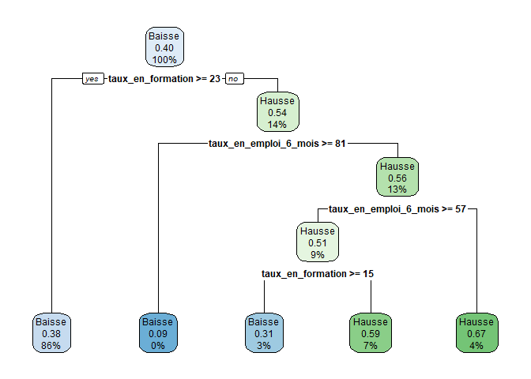
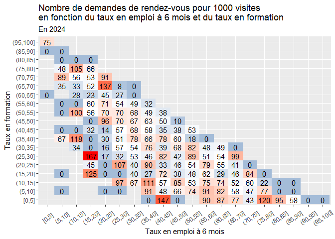
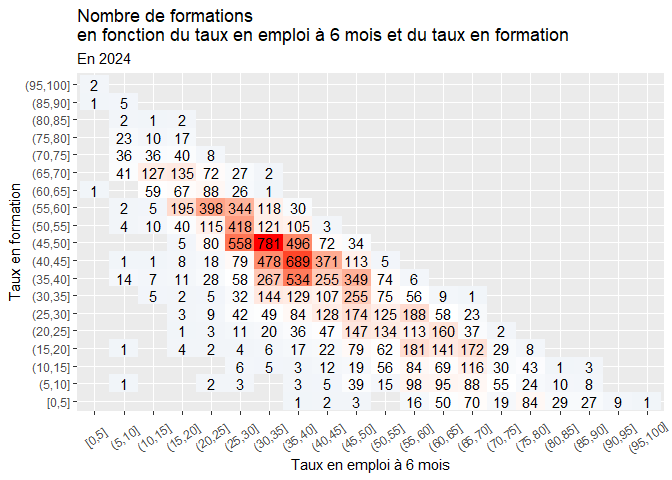
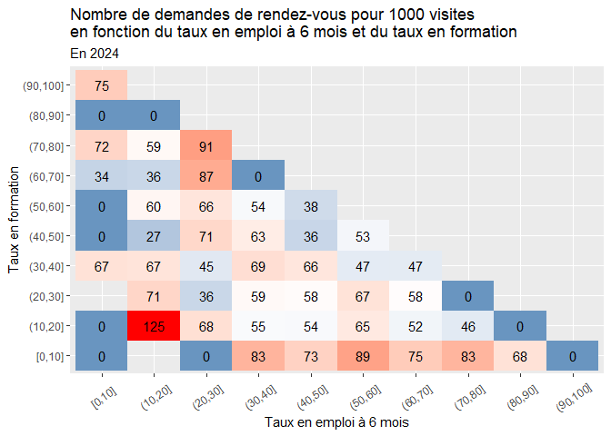
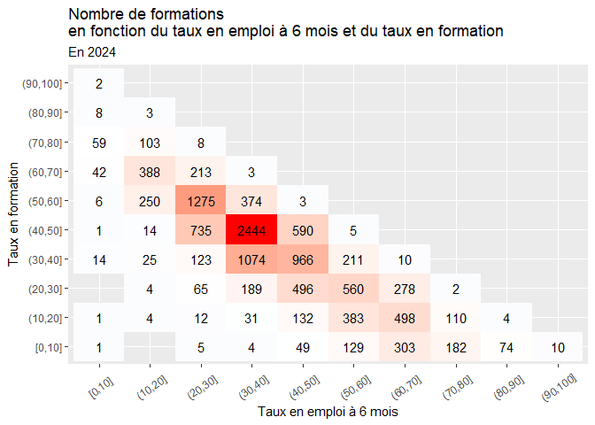
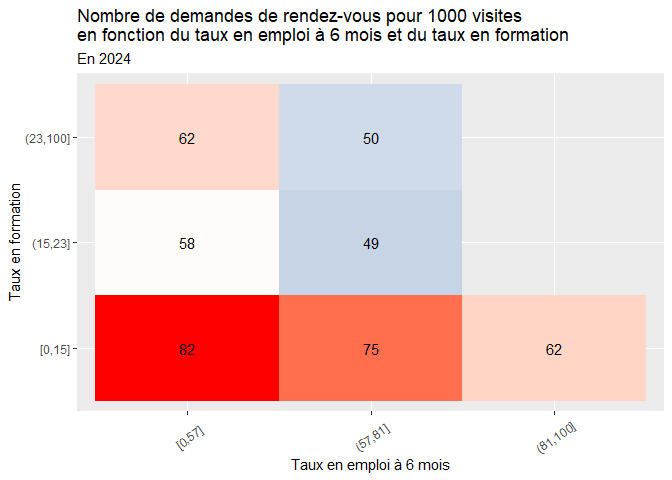
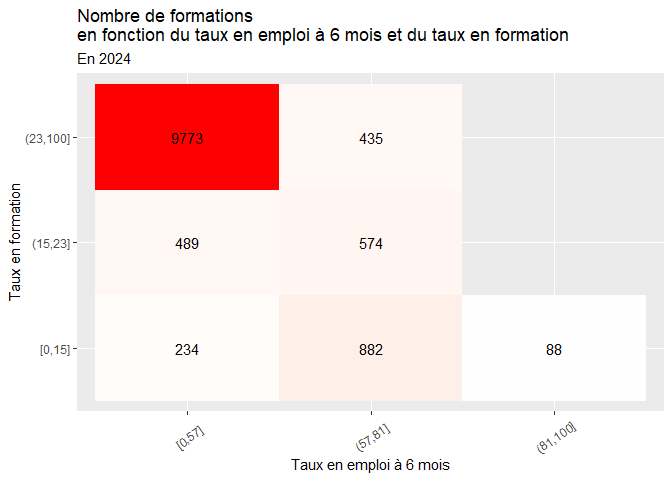
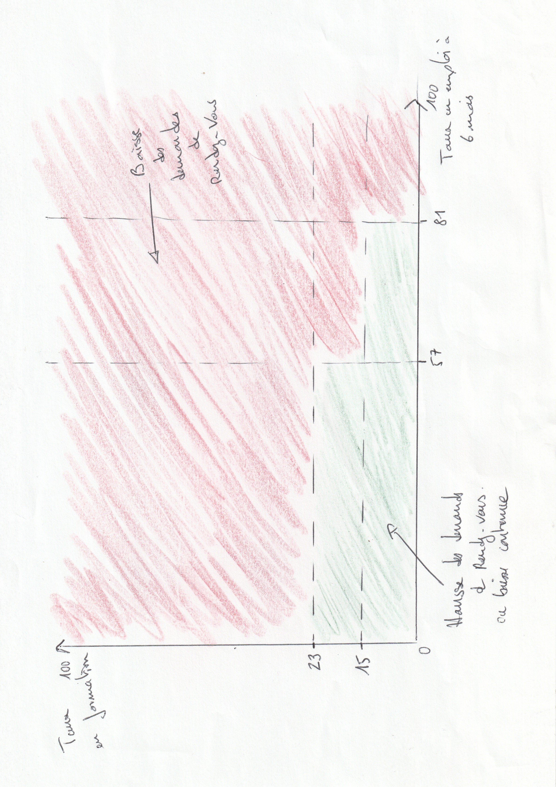

## Les questions

   -    L'exposition des données InserJeunes et les demandes de rendez-vous sur LBA ont-elles un lien?
   -    De meilleurs/moins bons taux d’insertion / d’emploi signifient t-ils des volumes de demandes de rendez-vous différents?  

## Cadre des données analysées

Les données analysées sont issues de LBA et concernent toutes les fiches formations ayant été consultées sur LBA:  

-   Entre le 1er fevrier et le 28 avril des années 2023 et 2024  
-   Ayant un CFD et un UAI valides  
-   Présentes sur le catalogue des ministères éducatifs en 2023 et en 2024  

Les formations présentes en 2023 sont utilisées comme groupe témoin. Avant le 15 mai 2023, aucune formation ne bénéficiait de l'exposition des données InserJeunes. Nous analysons l'évolution des demandes de rendez-vous en fonction de différents facteurs:  

-   L'affichage des données InserJeunes en 2024  
-   Le niveau d'entrée: avant ou après le bac  
-   Le taux de devenir favorable  
-   Le taux en emploi à 6 mois  
-   Le taux en formation  

19873 formations sont concernées par les demandes de rendez-vous selon les critères détaillés ci-dessus. 

## Quelques statistiques descriptives 

### Visites sur la période

Pour ces formations, on constate une forte hausse de 180% des visites entre 2023 et 2024 (de 32010 en 2023 à 89471 en 2024) :  

<table class=" lightable-paper" style='font-family: "Arial Narrow", arial, helvetica, sans-serif; margin-left: auto; margin-right: auto;'>
 <thead>
  <tr>
   <th style="text-align:right;"> 2023 - visiteurs </th>
   <th style="text-align:right;"> 2024 - visiteurs </th>
   <th style="text-align:left;"> Evolution visites </th>
  </tr>
 </thead>
<tbody>
  <tr>
   <td style="text-align:right;"> 32 010 </td>
   <td style="text-align:right;"> 89 471 </td>
   <td style="text-align:left;"> +180% </td>
  </tr>
</tbody>
</table>

### Demandes de rendez-vous sur la période

Pour ces formations, on constate une légère hausse de 1% des demandes de rendez-vous entre 2023 et 2024 ( de 5099 en 2023 à 5126 en 2024) :  

<table class=" lightable-paper" style='font-family: "Arial Narrow", arial, helvetica, sans-serif; margin-left: auto; margin-right: auto;'>
 <thead>
  <tr>
   <th style="text-align:right;"> 2023 - RDV </th>
   <th style="text-align:right;"> 2024 - RDV </th>
   <th style="text-align:left;"> Evolution RDV </th>
  </tr>
 </thead>
<tbody>
  <tr>
   <td style="text-align:right;"> 5 099 </td>
   <td style="text-align:right;"> 5 126 </td>
   <td style="text-align:left;"> +1% </td>
  </tr>
</tbody>
</table>

### Demandes de rendez-vous pour 1000 visites sur la période

Pour ces formations, on constate une baisse de  64% du nombre de demandes de rendez-vous pour 1000 visites entre 2023 et 2024 (de 159 en 2023 à 57 en 2024) :  

<table class=" lightable-paper" style='font-family: "Arial Narrow", arial, helvetica, sans-serif; margin-left: auto; margin-right: auto;'>
 <thead>
  <tr>
   <th style="text-align:right;"> 2023 - RDV pour 1000 visites </th>
   <th style="text-align:right;"> 2024 - RDV pour 1000 visites </th>
   <th style="text-align:left;"> Evolution rdv pour 1000 visites </th>
  </tr>
 </thead>
<tbody>
  <tr>
   <td style="text-align:right;"> 159 </td>
   <td style="text-align:right;"> 57 </td>
   <td style="text-align:left;"> -64% </td>
  </tr>
</tbody>
</table>

### Les formations ayant au moins une visite sur LBA

En 2023, 9938 de ces formations étaient concernées par une visite sur LBA (50% des formations). En 2024, 1.8214\times 10^{4} formations ont eu au moins une visite sur LBA sur la période d'analyse (92% des formations), soit une hausse des formations concernées par au moins une visite de 83% entre les deux périodes d'analyse. 

<table class=" lightable-paper" style='font-family: "Arial Narrow", arial, helvetica, sans-serif; margin-left: auto; margin-right: auto;'>
 <thead>
  <tr>
   <th style="text-align:left;"> Période </th>
   <th style="text-align:right;"> Nombre de formations ayant au moins une visite sur LBA </th>
   <th style="text-align:left;"> Part de formations ayant au moins une visite sur LBA </th>
  </tr>
 </thead>
<tbody>
  <tr>
   <td style="text-align:left;"> 2023 </td>
   <td style="text-align:right;"> 9 938 </td>
   <td style="text-align:left;"> 50% </td>
  </tr>
  <tr>
   <td style="text-align:left;"> 2024 </td>
   <td style="text-align:right;"> 18 214 </td>
   <td style="text-align:left;"> 92% </td>
  </tr>
</tbody>
</table>

### Les formations ayant au moins un rendez-vous sur LBA

En 2023, 2121 de ces formations étaient concernées par une demande de rendez-vous sur LBA(10.7% des formations). En 2024, 3446 formations ont reçu au moins une demande de rendez-vous sur LBA sur la période d'analyse (17.3% des formations), soit une hausse des formations concernées par au moins une demande de rendez-vous sur LBA de 62% entre les deux périodes d'analyse. 

<table class=" lightable-paper" style='font-family: "Arial Narrow", arial, helvetica, sans-serif; margin-left: auto; margin-right: auto;'>
 <thead>
  <tr>
   <th style="text-align:left;"> Période </th>
   <th style="text-align:right;"> Nombre de formations ayant au moins un rendez-vous sur LBA </th>
   <th style="text-align:left;"> Part de formations ayant au moins un rendez-vous sur LBA </th>
  </tr>
 </thead>
<tbody>
  <tr>
   <td style="text-align:left;"> 2023 </td>
   <td style="text-align:right;"> 2 121 </td>
   <td style="text-align:left;"> 10.7% </td>
  </tr>
  <tr>
   <td style="text-align:left;"> 2024 </td>
   <td style="text-align:right;"> 3 446 </td>
   <td style="text-align:left;"> 17.3% </td>
  </tr>
</tbody>
</table>

## Lien avec l'affichage des données IJ

*   **Demandes de rendez-vous**: Lorsque les formations ont un affichage des données IJ en 2024, on constate une baisse de 24% des demandes de rendez-vous. A l'inverse, lorsque les données IJ ne sont pas disponibles en 2024, on constate une hausse de 74% des demandes de rendez-vous.  

*   **Visites**:  Lorsque les formations ont un affichage des données IJ en 2024, on constate une hausse de 135% des visites de fiches formation. Lorsque les données IJ ne sont pas disponibles en 2024, on constate que cette hausse est encore plus forte avec 251% entre les deux périodes.  

*   **Demandes de rendez-vous pour 1000 visites**:  

    *   **En 2024**: Pour 1000 visites, il y a plus de demandes de rendez-vous pour les formations exposant les données IJ: 63 contre 51 demandes de rdv pour les formations n'exposant pas les données IJ.  
    *   **Evolution depuis 2023**: La baisse de demande de rendez-vous entre 2023 et 2024 est plus forte pour les formations exposant les données IJ (-68% vs -50%).  
  

<table class=" lightable-paper" style='font-family: "Arial Narrow", arial, helvetica, sans-serif; margin-left: auto; margin-right: auto;'>
 <thead>
<tr>
<th style="empty-cells: hide;" colspan="1"></th>
<th style="padding-bottom:0; padding-left:3px;padding-right:3px;text-align: center; " colspan="3">
Demandes de rdv
</th>
<th style="padding-bottom:0; padding-left:3px;padding-right:3px;text-align: center; " colspan="3">
Visites
</th>
<th style="padding-bottom:0; padding-left:3px;padding-right:3px;text-align: center; " colspan="3">
Demandes de rdv pour 1000 visites
</th>
</tr>
  <tr>
   <th style="text-align:left;"> Affichage des données IJ en 2024 </th>
   <th style="text-align:right;"> 2023 </th>
   <th style="text-align:right;"> 2024 </th>
   <th style="text-align:left;"> Evolution </th>
   <th style="text-align:right;"> 2023 </th>
   <th style="text-align:right;"> 2024 </th>
   <th style="text-align:left;"> Evolution </th>
   <th style="text-align:right;"> 2023 </th>
   <th style="text-align:right;"> 2024 </th>
   <th style="text-align:left;"> Evolution </th>
  </tr>
 </thead>
<tbody>
  <tr>
   <td style="text-align:left;"> Non </td>
   <td style="text-align:right;"> 1 265 </td>
   <td style="text-align:right;"> 2 199 </td>
   <td style="text-align:left;"> +74% </td>
   <td style="text-align:right;"> 12 249 </td>
   <td style="text-align:right;"> 42 991 </td>
   <td style="text-align:left;"> +251% </td>
   <td style="text-align:right;"> 103 </td>
   <td style="text-align:right;"> 51 </td>
   <td style="text-align:left;"> -50% </td>
  </tr>
  <tr>
   <td style="text-align:left;"> Oui </td>
   <td style="text-align:right;"> 3 834 </td>
   <td style="text-align:right;"> 2 927 </td>
   <td style="text-align:left;"> -24% </td>
   <td style="text-align:right;"> 19 761 </td>
   <td style="text-align:right;"> 46 480 </td>
   <td style="text-align:left;"> +135% </td>
   <td style="text-align:right;"> 194 </td>
   <td style="text-align:right;"> 63 </td>
   <td style="text-align:left;"> -68% </td>
  </tr>
</tbody>
</table>

## Lien avec le niveau de formation

*   **Demandes de rendez-vous**: Les formations infra-bac voient une hausse de 101% des demandes de rendez-vous entre 2023 et 2024. A l'inverse, les formations post-bac voient une baisse de 25% des demandes de rendez-vous entre 2023 et 2024.  

*   **Visites**: L'évolution des visites des fiches formation est assez proche entre les formations post-bac et infra-bac (resp. +175% et +187%).  

*   **Demandes de rendez-vous pour 1000 visites**:  

    *   **En 2024: Pour 1000 visites**, il y a plus de demandes de rendez-vous pour les formations infra-bac que post-bac: 64 contre 53 demandes de rdv pour les formations post-bac.  
    *   **Evolution depuis 2023**: En 2023, il y avait plus de demandes de rendez-vous pour les formations post-bac que pour les formations infra-bac (195 contre 92). Il en découle une baisse beaucoup plus importante des demandes de rendez-vous pour 1000 visites concernant les formations post-bac (-73% vs -30%).    

<table class=" lightable-paper" style='font-family: "Arial Narrow", arial, helvetica, sans-serif; margin-left: auto; margin-right: auto;'>
 <thead>
<tr>
<th style="empty-cells: hide;" colspan="1"></th>
<th style="padding-bottom:0; padding-left:3px;padding-right:3px;text-align: center; " colspan="3">
Demandes de rdv
</th>
<th style="padding-bottom:0; padding-left:3px;padding-right:3px;text-align: center; " colspan="3">
Visites
</th>
<th style="padding-bottom:0; padding-left:3px;padding-right:3px;text-align: center; " colspan="3">
Demandes de rdv pour 1000 visites
</th>
</tr>
  <tr>
   <th style="text-align:left;"> Avant/Après le bac </th>
   <th style="text-align:right;"> 2023 </th>
   <th style="text-align:right;"> 2024 </th>
   <th style="text-align:left;"> Evolution </th>
   <th style="text-align:right;"> 2023 </th>
   <th style="text-align:right;"> 2024 </th>
   <th style="text-align:left;"> Evolution </th>
   <th style="text-align:right;"> 2023 </th>
   <th style="text-align:right;"> 2024 </th>
   <th style="text-align:left;"> Evolution </th>
  </tr>
 </thead>
<tbody>
  <tr>
   <td style="text-align:left;"> Avant le bac </td>
   <td style="text-align:right;"> 1 029 </td>
   <td style="text-align:right;"> 2 066 </td>
   <td style="text-align:left;"> +101% </td>
   <td style="text-align:right;"> 11 187 </td>
   <td style="text-align:right;"> 32 113 </td>
   <td style="text-align:left;"> +187% </td>
   <td style="text-align:right;"> 92 </td>
   <td style="text-align:right;"> 64 </td>
   <td style="text-align:left;"> -30% </td>
  </tr>
  <tr>
   <td style="text-align:left;"> Après le bac </td>
   <td style="text-align:right;"> 4 070 </td>
   <td style="text-align:right;"> 3 060 </td>
   <td style="text-align:left;"> -25% </td>
   <td style="text-align:right;"> 20 823 </td>
   <td style="text-align:right;"> 57 358 </td>
   <td style="text-align:left;"> +175% </td>
   <td style="text-align:right;"> 195 </td>
   <td style="text-align:right;"> 53 </td>
   <td style="text-align:left;"> -73% </td>
  </tr>
</tbody>
</table>

<!--

## Lien avec l'affichage des données IJ et le niveau de formation

*   **Demandes de rendez-vous**: Sans affichage de donneés IJ, la hause concerne les formations post et infra-bac même si on constate une plus forte hausse pour l'infra-bac (+209% contre +57%). 
A l'inverse, avec affichage des données IJ les formations post-bac voient une baisse de 56% des demandes de rendez-vous entre 2023 et 2024 alors que dans le même temps les formations infra-bac voient une hausse de 84% des demandes de rendez-vous. Cette hauuse est néanmoins inférieure à celle observée pour les formations infra-bac sans affichage de données IJ. 

*   **Visites**: Sans affichage de données IJ, l'évolution du nombre de visites est en hausse et relativement similaire pour les formations post et infra-bac (~ +250%). En revanche, cette hausse est pluys marquée pour les formations infra-bac ayant un affichage de données IJ que pour les formations post-bac ayant un affichage des données IJ (+167% vs +109%).    

*   **Demandes de rendez-vous pour 1000 visites**:  Ainsi, les formations infra-bac sans affichage de données IJ ont une baisse moins importante des demandes de rendez-vous pour 1000 visites que les formations infra-bac avec exposition des données IJ. Il en va de même pour les formations post-bac.  

<table class=" lightable-paper" style='font-family: "Arial Narrow", arial, helvetica, sans-serif; margin-left: auto; margin-right: auto;'>
 <thead>
<tr>
<th style="empty-cells: hide;" colspan="1"></th>
<th style="empty-cells: hide;" colspan="1"></th>
<th style="padding-bottom:0; padding-left:3px;padding-right:3px;text-align: center; " colspan="3">
Demandes de rdv
</th>
<th style="padding-bottom:0; padding-left:3px;padding-right:3px;text-align: center; " colspan="3">
Visites
</th>
<th style="padding-bottom:0; padding-left:3px;padding-right:3px;text-align: center; " colspan="3">
Demandes de rdv pour 1000 visites
</th>
</tr>
  <tr>
   <th style="text-align:left;"> Affichage des données IJ en 2024 </th>
   <th style="text-align:left;"> Avant/Après le bac </th>
   <th style="text-align:right;"> 2023 </th>
   <th style="text-align:right;"> 2024 </th>
   <th style="text-align:left;"> Evolution </th>
   <th style="text-align:right;"> 2023 </th>
   <th style="text-align:right;"> 2024 </th>
   <th style="text-align:left;"> Evolution </th>
   <th style="text-align:right;"> 2023 </th>
   <th style="text-align:right;"> 2024 </th>
   <th style="text-align:left;"> Evolution </th>
  </tr>
 </thead>
<tbody>
  <tr>
   <td style="text-align:left;"> Non </td>
   <td style="text-align:left;"> Avant le bac </td>
   <td style="text-align:right;"> 140 </td>
   <td style="text-align:right;"> 432 </td>
   <td style="text-align:left;"> +209% </td>
   <td style="text-align:right;"> 2 536 </td>
   <td style="text-align:right;"> 8 945 </td>
   <td style="text-align:left;"> +252.7% </td>
   <td style="text-align:right;"> 55 </td>
   <td style="text-align:right;"> 48 </td>
   <td style="text-align:left;"> -13% </td>
  </tr>
  <tr>
   <td style="text-align:left;"> Non </td>
   <td style="text-align:left;"> Après le bac </td>
   <td style="text-align:right;"> 1 125 </td>
   <td style="text-align:right;"> 1 767 </td>
   <td style="text-align:left;"> +57% </td>
   <td style="text-align:right;"> 9 713 </td>
   <td style="text-align:right;"> 34 046 </td>
   <td style="text-align:left;"> +250.5% </td>
   <td style="text-align:right;"> 116 </td>
   <td style="text-align:right;"> 52 </td>
   <td style="text-align:left;"> -55% </td>
  </tr>
  <tr>
   <td style="text-align:left;"> Oui </td>
   <td style="text-align:left;"> Avant le bac </td>
   <td style="text-align:right;"> 889 </td>
   <td style="text-align:right;"> 1 634 </td>
   <td style="text-align:left;"> +84% </td>
   <td style="text-align:right;"> 8 651 </td>
   <td style="text-align:right;"> 23 168 </td>
   <td style="text-align:left;"> +167.8% </td>
   <td style="text-align:right;"> 103 </td>
   <td style="text-align:right;"> 71 </td>
   <td style="text-align:left;"> -31% </td>
  </tr>
  <tr>
   <td style="text-align:left;"> Oui </td>
   <td style="text-align:left;"> Après le bac </td>
   <td style="text-align:right;"> 2 945 </td>
   <td style="text-align:right;"> 1 293 </td>
   <td style="text-align:left;"> -56% </td>
   <td style="text-align:right;"> 11 110 </td>
   <td style="text-align:right;"> 23 312 </td>
   <td style="text-align:left;"> +109.8% </td>
   <td style="text-align:right;"> 265 </td>
   <td style="text-align:right;"> 55 </td>
   <td style="text-align:left;"> -79% </td>
  </tr>
</tbody>
</table>

-->

## Zoom sur les formations ayant un affichage de données IJ en 2024

### Lien avec le niveau de formation, le taux en emploi à 6 mois et le taux en formation

#### Arbre de décision

Nous avons testé une méthode de partitionnement récursif pour déterminer des seuils discriminants pour la hausse du nombre de demandes de rendez-vous pour 1000 visites. 

Ainsi, l'arbre de décision ci-dessous tend à montrer que le nombre de demandes de rendez-vous pour 1000 visites est en baisse si:  

*   Le taux en formation est supérieur ou égal à 23%,   
*   Le taux en emploi à 6 mois est suprieur ou égal à 81%,  
*   Le taux en formation est compris entre 15 et 23% et taux en emploi à 6 mois est compris entre 57 et 81%.  

<!-- -->

#### Heatmap

##### Par tranche de 5%

###### Demandes de rendez-vous pour 1000 visites

<!-- -->

###### Nombre de formations

<!-- -->

##### Par tranche de 10%

###### Demandes de rendez-vous pour 1000 visites

<!-- -->

###### Nombre de formations

<!-- -->

##### Par les seuils déterminés par l'arbre de décision

###### Demandes de rendez-vous pour 1000 visites

<!-- -->

###### Nombre de formations

<!-- -->

#### Synthèse

*   **Demandes de rendez-vous**: infra-bac voient une hausse de 101% des demandes de rendez-vous entre 2023 et 2024. A l'inverse, les formations post-bac voient une baisse de 25% des demandes de rendez-vous entre 2023 et 2024.  

*   **Visites**: L'évolution des visites des fiches formation est assez proche entre les formations post-bac et infra-bac (resp. +175% et +187%).  

*   **Demandes de rendez-vous pour 1000 visites**:  

    *   **En 2024**: Les formations ayant un taux de devenir "plutôt moins favorable" ont plus de demandes de rendez-vous pour 1000 visites que les formations à taux de devenir "plutôt plus favorable" (72 contre 61).  
    *   **Evolution depuis 2023**: En 2023, il y avait beaucoup plus de demandes de rendez-vous pour les formations à taux de devenir "plutôt plus favorable" (211 contre 61 en 2024, soit une baisse de 71% des demandes de rendez-vous). La baisse des demandes de rendez-vous est plus contenue pour les formations à taux de devenir "plutôt moins favorable" (-12% contre -71% pour les formations à taux de devenir "plutôt plus favorable").  

<table class=" lightable-paper" style='font-family: "Arial Narrow", arial, helvetica, sans-serif; margin-left: auto; margin-right: auto;'>
 <thead>
<tr>
<th style="empty-cells: hide;" colspan="1"></th>
<th style="padding-bottom:0; padding-left:3px;padding-right:3px;text-align: center; " colspan="3">
Demandes de rdv
</th>
<th style="padding-bottom:0; padding-left:3px;padding-right:3px;text-align: center; " colspan="3">
Visites
</th>
<th style="padding-bottom:0; padding-left:3px;padding-right:3px;text-align: center; " colspan="3">
Demandes de rdv pour 1000 visites
</th>
<th style="padding-bottom:0; padding-left:3px;padding-right:3px;text-align: center; " colspan="3">
Formation ayant reçu au moins une demande de rdv
</th>
</tr>
  <tr>
   <th style="text-align:left;"> Groupe de taux en emploi et en formation </th>
   <th style="text-align:right;"> 2023 </th>
   <th style="text-align:right;"> 2024 </th>
   <th style="text-align:left;"> Evolution </th>
   <th style="text-align:right;"> 2023 </th>
   <th style="text-align:right;"> 2024 </th>
   <th style="text-align:left;"> Evolution </th>
   <th style="text-align:right;"> 2023 </th>
   <th style="text-align:right;"> 2024 </th>
   <th style="text-align:left;"> Evolution </th>
   <th style="text-align:right;"> 2023 </th>
   <th style="text-align:right;"> 2024 </th>
   <th style="text-align:left;"> Evolution </th>
  </tr>
 </thead>
<tbody>
  <tr>
   <td style="text-align:left;"> Taux de devenir "plutôt moins favorable" </td>
   <td style="text-align:right;"> 215 </td>
   <td style="text-align:right;"> 567 </td>
   <td style="text-align:left;"> +164% </td>
   <td style="text-align:right;"> 2 632 </td>
   <td style="text-align:right;"> 7 850 </td>
   <td style="text-align:left;"> +198% </td>
   <td style="text-align:right;"> 82 </td>
   <td style="text-align:right;"> 72 </td>
   <td style="text-align:left;"> -12% </td>
   <td style="text-align:right;"> 119 </td>
   <td style="text-align:right;"> 327 </td>
   <td style="text-align:left;"> +175% </td>
  </tr>
  <tr>
   <td style="text-align:left;"> Taux de devenir "plutôt plus favorable": Taux en empoi à 6 mois &gt;= 81%, taux en formation &gt;= 23 ou taux en formation est compris entre 15 et 23% et taux en emploi à 6 mois est compris entre 57 et 81% </td>
   <td style="text-align:right;"> 3 619 </td>
   <td style="text-align:right;"> 2 360 </td>
   <td style="text-align:left;"> -35% </td>
   <td style="text-align:right;"> 17 129 </td>
   <td style="text-align:right;"> 38 630 </td>
   <td style="text-align:left;"> +126% </td>
   <td style="text-align:right;"> 211 </td>
   <td style="text-align:right;"> 61 </td>
   <td style="text-align:left;"> -71% </td>
   <td style="text-align:right;"> 1 497 </td>
   <td style="text-align:right;"> 1 697 </td>
   <td style="text-align:left;"> +13% </td>
  </tr>
</tbody>
</table>

<!--
### Lien avec le niveau de formation et le taux de devenir favorable

10% des formations ont un taux de devenir favorable inférieur à 68% et 25% des formations ont un taux de devenir favorable inférieur à 74%.

Un taux de devenir favorable faible (Q25: premier quartile) correspond à une valeur de 72% pour l’infra-bac et 78% pour le post-bac.

L'arbre de décision suivant tend à montrer que les utilisateurs demandent plus de rendez-vous lorsque le taux de devenir favorable est compris entre 73 et 83%.

<!-- -->

-->

<!--

*   **Demandes de rendez-vous**: Le premier quartile de taux de devenir favorable (72% pour l’infra-bac et 78% pour le post-bac) est discriminant pour les formations infra et post-bac. 

**Deux constats relativement proches à nuancer néanmoins:**

- **Pour les formations infra-bac:**
    
    Il y a une hausse plus importante des demandes de rendez-vous pour les formations ayant un faible taux de devenir favorable.
    
- **Pour les formations post-bac:**
    
    Il y a une baisse moins importante des demandes de rendez-vous pour les formations ayant un faible taux de devenir favorable.
    

Les formations post-bac ayant un faible taux de devenir favorable voient une baisse moins importante qu’au dessus de ce seuil (-56% contre -67%). De la même façon, concernant l’infra-bac, on constate une hausse plus importante des demandes de rendez-vous pour les formations ayant un faible taux de devenir favorable (+86% contre +27%).  

*   **Visites**:  
*   **Demandes de rendez-vous pour 1000 visites**:  

Explications possibles : 

1. Les futurs lycéens et étudiants sont peut-être plus dans une zone d’incertitude (incompréhension des données ou besoin de davantage d’informations) en dessous de 74% et sollicitent alors les établissements pour plus de renseignements.
2. Les vœux sur les plateformes d’affectation sont corrélés aux demandes de rendez-vous : il y a moins de demandes de rendez-vous car ce sont des formations qui intéressent moins.

En abaissant le seuil du taux de devenir favorable au 10ème quantile (Q10), le phénomène observé au seuil faible (Q25) s’accentue. Il y a une plus forte hausse des demandes de rendez-vous pour les formations post-bac ayant un très faible taux de devenir favorable et la baisse des demandes de rendez-vous est moins 
-->

