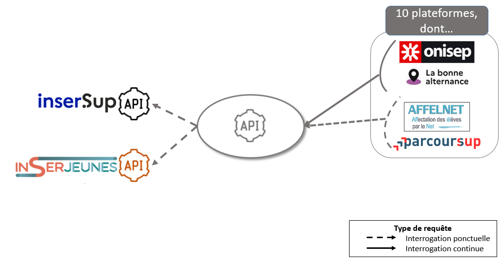

# Transfert du service vers l'administration (Mai 2025 - Janvier 2026)
{: .no_toc }

## Table des matières
{: .no_toc .text-delta }
- TOC
{:toc}

## Reprise de l’API et des traitements des données par l’administration

### Objectifs
{: .no_toc }

L’objectif de la reprise technique est d’**assurer la continuité** du service offert aux ré-utilisateurs, **suite à la fin de mission** de l’équipe actuellement chargée du développement du produit, en **fin d’année 2025**.

La reprise **technique** se concentre sur les traitements des données et la mise à disposition des indicateurs via une API.

Cette reprise doit se faire : 
- avec un **impact minimal sur les systèmes en place des ré-utilisateurs**. Des changements d’URL et de clefs seront à anticiper du côté des ré-utilisateurs.
- **sans discontinuité de service**, notamment pour les ré-utilisateurs utilisant l’API tout au long de l’année et non en “campagne”.
- en favorisant les **synergies avec les autres produits** tels qu’[Orion](https://orion.education.gouv.fr/).

Les systèmes mis en place devront en outre permettre d’intégrer les nouvelles données produites par les services statistiques (nouveaux diplômes, nouvelles mailles, etc.) et les évolutions priorisées lors des comités de pilotage.

### Scénario de reprise privilégié
{: .no_toc }

Suite aux échanges avec les différents acteurs, le scénario de reprise suivant est privilégié :

- **la DNE est en charge de l'API d'Exposition**. Cette API fait le lien entre les producteurs de la donnée (services statistiques) et les ré-utilisateurs.
- **les services statistiques sont en charge d'alimenter l'API d'Exposition via leurs API respectives**. Les données fournies sont déjà traitées (historisation, liens entre établissements, liens entre années de formation) minimisant les manipulations liées à la donnée nécessaires au niveau de l'API d'Exposition.
- **les plateformes ré-utilisatrices appellent l’API en autonomie**, en continu ou en amont d’une campagne.

*API Exposition - Schéma créé par la DEPP*

Dans un premier temps, **la DNE reprend l'API actuelle en l’état et en intégralité**. Dans un second temps, à l'issue de l'"atterissage" du projet et en fonction des chantiers techniques (modification de l'import, changements de technologies, etc.), **il pourra être intéressant de revoir l'organisation du projet en transférant toute ou partie de la gestion des "traitements" (historisation, rapprochements entre UAI ou formations) aux services statistiques, notamment la DEPP**.

## Autonomisation de Parcoursup

Pour les campagnes Parcoursup avant 2026, un [script]({{ site.baseurl }}) était maintenu par la mission pour : 

- Identifier un code certification exploitable (CFD, MEFSTAT11 ou SISE) pour un maximum de formations du catalogue ParcourSup,
- Associer les données d’insertion et de rémunération (Exposition) à chaque élément du catalogue.

En vue de la fin de mission de l'équipe, des travaux ont été entrepris pour transférer ces travaux vers l'administration : 

- Intégration des traitements mis en œuvre dans le script au sein de l'API, pour profiter à l'ensemble des utilisateurs,
- Accompagnement des équipes de Parcoursup pour une utilisation autonome de l'API,
- identification de solutions pour consolider les identifiants du catalogue Parcoursup, notamment des codes SISE (en attendant FRESQ)