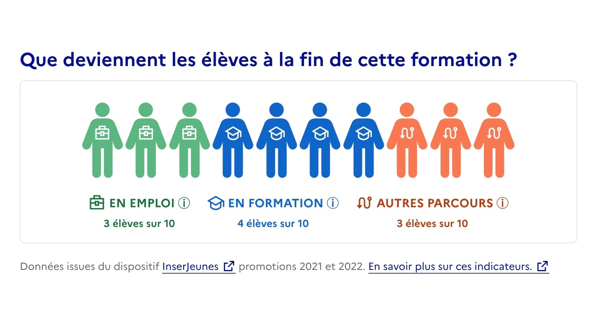

# Exposition “grand public” des indicateurs InserJeunes & InserSup
{: .no_toc }

{: .highlight }
Un service numérique public développé par la mission interministérielle InserJeunes, membre du [réseau beta.gouv](https://beta.gouv.fr/), entre Avril 2022 et Mai 2025, dans le but d'éclairer les choix d’orientation des jeunes en exposant des données pertinentes relatives aux parcours de formation et à l’insertion professionnelle.

- TOC
{:toc}

## La problématique

Les choix d’orientation sont fondés sur des **informations partielles et subjectives concernant les parcours de formation et le marché de l’emploi**.

Bon nombre de jeunes s’orientent, ou sont orientés, vers les **filières les plus connues, mais qui s’avèrent souvent sans perspectives**.

{: .note }
💡 **1/3 des vœux** prioritaires pour le scolaire sur Affelnet se sont fait en 2021 **vers des filières sans perspectives** (taux d’emploi < 30% ET taux de poursuite d’études < 50%)

Pourtant, d’autres filières offrent des devenirs plus favorables. Et **des données**, issues notamment des services statistiques du MENJ, MESRI et du MTPEI, qui permettraient d’éclairer ces choix d’orientation **existent** et sont enrichies régulièrement.

Elles ne sont malheureusement **pas connues** des jeunes et de leurs accompagnateurs et sont **difficilement compréhensibles.**

{: .note }
💡 **Seulement 22k vues sur le site InserJeunes en 2022**, alors qu’un site d’information tel que l’Onisep accueille plusieurs millions de visites par mois. (11/23 : [3.7M visites](https://fr.semrush.com/website/onisep.fr/overview/))

{: .note }
📍 Une problématique inscrite dans plusieurs **politiques prioritaires du gouvernement** : refondre l'orientation des élèves, améliorer le taux d'emploi des jeunes, réduire les tensions de recrutement, faire du lycée professionnel une voie de réussite et d'accès à l'emploi.

## Notre mission

{: .highlight }
🎯 Éclairer les choix d’orientation des jeunes en exposant des données pertinentes relatives aux parcours de formation et à l’insertion professionnelle.

## Notre solution

Nous **construisons** un service destiné à **diffuser des informations de référence** précises et contextualisées, permettant d’**éclairer les choix d’orientation d’un maximum de jeunes**.

Pour cela, nous :

- Collectons des données et **synthétisons des indicateurs quantitatifs de référence, simples à comprendre**, relatifs à l’orientation et à l’insertion professionnelle, à partir de diverses sources (scolaire, supérieur, travail, etc.).
- **Diffusons ces indicateurs** auprès des parties prenantes impliquées dans l’orientation des jeunes

## Aperçu de notre action

Nous collectons les données diffusées par les services statistiques du **Ministère de l’Éducation nationale et de la jeunesse** **(DEPP)**, du **Ministère de l’Enseignement supérieur, de la Recherche et de l’Innovation (SIES),** du **Ministère du Travail, du Plein emploi et de l'Insertion (DARES)** ainsi que d’autres entités.

→ [Jeux de données manipulés]({{ site.baseurl }})

Ces données sont connectées, croisées, enrichies…

→ [Traitements des données]({{ site.baseurl }})

… et viennent peupler notre propre base de donnée dont l’objectif et de servir de source d’informations de référence, fiables, utiles et accessibles pour éclairer les choix d’orientation des jeunes et de leurs accompagnateurs.

→ [Base de données & Indicateurs]({{ site.baseurl }})

Les indicateurs contenus dans notre base sont diffusés, via une API, auprès des acteurs de l’orientation tels que l’Onisep, Parcoursup, Affelnet, 1jeune1solution, La bonne alternance, l’Étudiant, etc. et viennent enrichir les chemins d’orientation déjà empruntés par les jeunes.

→ [API Exposition]({{ site.baseurl }})

Ces acteurs sont accompagnés pour monter en compétence sur la donnée manipulée, la prise en main de notre API et l’exposition efficace des indicateurs (notamment la conception, les tests, l’analyse de modules de visualisation des données).

→ [Documentation]({{ site.baseurl }})

Plus de détail dans [Plus-value du projet et propositions pour la suite]({{ site.baseurl }}).