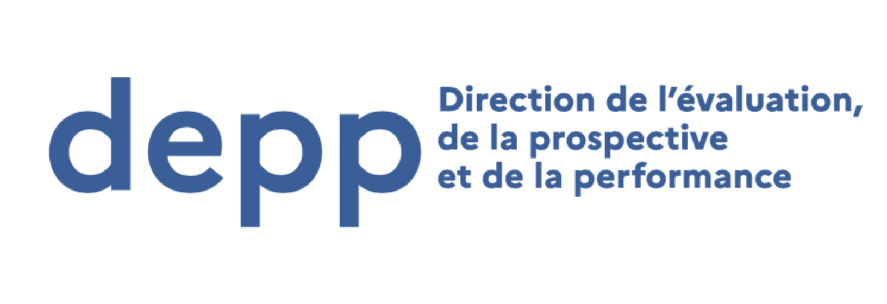

# 📚 Centre de documentation InserJeunes
{: .no_toc }

{: .highlight }
Données et indicateurs de l’exposition au grand public

## Table des matières
{: .no_toc .text-delta }
- TOC
{:toc}

## Introduction

**Notre mission est de soutenir la liberté de choisir son avenir professionnel en exposant au grand public et aux futurs élèves des indicateurs clés sur les formations.**
Ces indicateurs ont vocation a éclairer sur les chances d’employabilité des élèves en sortie de formation, mais aussi sur les possibilités de poursuite d’études.

**La qualité des données et le taux de couverture sont nos priorités.** 
Le taux de couverture correspond au nombre de formations exposant des données fiables. Cette couverture des données doit tendre à la plus grande exhaustivité.

Nos données sont exposées sur différentes plateformes partenaires telles que ParcourSup, AFFELNET ou l’ONISEP.

Pour en savoir plus sur notre mission, rendez-vous sur [notre fiche produit](https://beta.gouv.fr/startups/exposition-ij.html).

## Les indicateurs InserJeunes

### 💼 Nombre d’étudiants en emploi

Tous les emplois salariés liés ou non au secteur de formation

### 📚 Nombre d’étudiants poursuivant leur formation

Poursuite d’études, redoublement, 
changement d’orientation…

### 🚗 Autres parcours

Recherche d’emploi, auto-entreprise, à l’étranger…

### Le mode de calcul des trois indicateurs InserJeunes

Nombre d’étudiants en emploi  : Taux d’insertion à 6 mois à travers la part en emploi

**Mode de calcul :** nombre de jeunes insérés dans l’emploi / effectif total de la dernière année de formation*

**les taux sont calculés sur le nombre d’élèves en année terminale sauf pour les formations en “Licence Pro” et “Master” pour lesquelles ils sont calculés sur le nombre de diplômés.*

Le nombre de jeunes insérés dans l’emploi est déterminé 6 mois après la fin de leur formation. Cela consiste à dénombrer ceux pour qui une déclaration sociale nominative a été saisie par une entreprise, qui atteste que la personne est en emploi dans cette entreprise. 
Ce calcul n’est pas basé sur une enquête adressée aux jeunes.
De ce fait tous **les jeunes en emploi non salarié ne sont pas pris en compte dans ce chiffre**.

**A noter :** l’ensemble de l’emploi public est couvert seulement depuis **2022**.

Nombre d’étudiants poursuivant leur formation : Taux d’étudiants inscrits en formation à 6 mois en sortie de formation

 
**Mode de calcul** : nombre de jeunes inscrits en année N+1 / effectif total de la dernière année de formation*

**les taux sont calculés sur le nombre d’élèves en année terminale sauf pour les formations en “Licence Pro” et “Master” pour lesquelles ils sont calculés sur le nombre de diplômés.*

Cet indicateur comptabilise le nombre d’étudiants inscrits dans une formation, qu’il s’agisse d’un autre niveau d’étude, d’un redoublement,  d’une réorientation vers une nouvelle formation…
L’indicateur ne tient pas compte de la continuité dans un parcours de formation pour le moment.
Pour exemple, cet indicateur ne témoigne pas qu’un jeune qui a commencé à se former en cuisine poursuit ses études en cuisine : il peut avoir décidé de changer d’orientation et il sera comptabilisé en poursuite d’études dès lors qu’il suit une formation?

**A noter :** l’Insertion dans l’emploi, la Poursuite d’études et les autres parcours, sont comparables et la somme de leur taux atteint 100%. En effet, la base commune de calcul est l’effectif total de la terminale ou dernière année de formation. 

Autres parcours : Taux d’étudiants effectuant d’autres parcours à 6 mois en sortie de formation

**Mode de calcul** : (nombre d’effectifs total de la dernière année de formation) - (ceux qui sont en emploi ou en poursuite d’étude)*

**les taux sont calculés sur le nombre d’élèves en année terminale sauf pour les formations en “Licence Pro” et “Master” pour lesquelles ils sont calculés sur le nombre de diplômés.*

Il s’agit du nombre d’étudiant n’appartenant ni au taux en emploi, ni au taux en poursuite de formation. C’est-à-dire qu’il s’agit des étudiants qui n’ont pas pu être catégorisé sur une base liée à la scolarité ou une base emploi.
Ils peuvent être au chômage, en inactivité, en indépendant, parties à l’étranger, en formation privée hors contrat ou encore en service civique. Cette liste des cas possibles est non exhaustive. 

**A noter :** plusieurs chantiers sont menés par nos partenaires pour qualifier les poursuites d’études et pour qualifier l’emploi après avoir suivi une formation.

{: .highlight }
> 📌 Les données sont mises à disposition en “*open data*” par : 
> - [la Direction de l'Evaluation de la Prospective et de la Performance (DEPP) du Ministère de l’Éducation nationale](https://www.education.gouv.fr/les-donnees-de-la-depp-disponibles-en-opendata-342478)
> - [la sous-direction des Systèmes d'Information et des Études Statistiques (SIES) du Ministère de l’Enseignement supérieur et de la Recherche](https://data.enseignementsup-recherche.gouv.fr/explore/dataset/fr-esr-insersup/information/?disjunctive.source&disjunctive.reg_id&disjunctive.aca_id&disjunctive.id_paysage&disjunctive.id_paysage_actuel&disjunctive.etablissement&disjunctive.type_diplome&disjunctive.dom&disjunctive.discipli&disjunctive.sectdis&disjunctive.diplome&disjunctive.date_inser)

**Limitation de diffusion des données pour des raisons statistiques** : afin de préserver une robustesse statistique des données, celles-ci sont indisponibles lorsque le nombre d’apprenants est **inférieur à 20**.

### Couverture de l’emploi public et du volontariat de service civique

**Pour les millésimes 2022 et les suivant,** l’emploi public sera désormais bien comptabilisé dans le nombre d’élèves en emploi pour les formations du CAP au BTS. 

Pour en savoir plus sur ce travail, rendez-vous sur la page dédiée : [Couverture de l’emploi public et du volontariat de service civique]({{ site.baseurl }})

### La continuité des données dans le cadre de la rénovation des formations

Dans le cadre de la rénovation du catalogue des formations, un certain nombre de formations et de diplômes ont été renommés sans changement du contenu de leurs programmes. Ces formations étaient alors considérées comme nouvelles, aucune donnée sur le devenir des apprenants n’a pour l’instant été calculé pour les promotions sortant de ces formations.

**Nous avons pu rétablir le lien qui avait été rompu entre les données recueillies sur une certification avant et après son changement de nom.**

Pour en savoir plus sur ce travail, rendez-vous sur la page dédiée : [La continuité des données dans le cadre de la rénovation des formations]({{ site.baseurl }})

### Familles de métiers et années intermédiaires

Avant 2025, les indicateurs InserJeunes ne pouvaient être récupérés que pour une année terminale, correspondant à une certification (par exemple une année de Terminale dans le cadre d’un Bac Pro).

Désormais, **il est possible de récupérer les indicateurs pour une année intermédiaire** (par exemple une 1ère dans le cadre d’un Bac Pro). Le lien est alors fait avec la dernière année du cursus, qui dispose d’indicateurs sur la poursuite d’études et l’insertion dans l’emploi.

**Dans les cadre de 2des professionnelles communes, au sein de familles de métiers, le lien est fait avec la famille de métiers** (par exemple “Réalisation d'ensembles mécaniques et industriels”) **et l’ensemble des Bac Pro de spécialité**, permettant d’offrir de la visibilité sur le devenir des élèves à partir de l’année d’entrée dans le cursus, celle qui doit faire l’objet d’un vœu d’affectation sur Affelnet notamment.

[En savoir plus sur les familles de métiers en 2de professionnelles (Onisep)](https://www.onisep.fr/formation/apres-la-3-la-voie-professionnelle/les-diplomes-de-la-voie-pro/le-bac-professionnel/les-familles-de-metiers).

## Les indicateurs de rémunération

**Pour chaque formation, à l’échelle de la France**, trois seuils sont mis à disposition : 

### 🌘 Premier quartile

25% des salariés gagnent moins

### 🌗 Salaire médian

50% des salariés gagnent moins, 50% gagnent plus

### 🌖 Troisième quartile

25% des salariés gagnent plus

### Mode de calcul

Les salaires sont : 

- des **salaires nets** (avant impôt sur le revenu)
- **par mois**, en équivalent temps-plein
- **observés 12 mois après la sortie de formation**

{: .highlight }
> 📌 Les données sont mises à disposition en “*open data*” par la Direction de l'Animation de la Recherche, des Études et des Statistiques (DARES) du Ministère du Travail et de l’Emploi, la Direction de l'Evaluation de la Prospective et de la Performance (DEPP) du Ministère de l’Éducation nationale et la sous-direction des Systèmes d'Information et des Études Statistiques (SIES) du Ministère de l’Enseignement supérieur et de la Recherche  :
> - [Les données](https://www.education.gouv.fr/l-insertion-des-jeunes-apres-une-formation-en-voie-professionnelle-307956#edugouv-summary-item-6)
> - [Note méthodologique](https://www.education.gouv.fr/l-insertion-des-jeunes-apres-une-formation-en-voie-professionnelle-307956#edugouv-summary-item-2)

**Limitation de diffusion des données pour des raisons statistiques :** afin de préserver une robustesse statistique des données, celles-ci sont indisponibles lorsque le nombre d’apprenants est **inférieur à 20.**

### Remarques et limitations

- Les salaires présentés sont indicatifs et **nationaux**. Il existe une grande variabilité selon les territoires, les conditions de travail et les entreprises.
- Les salaires présentés sont ceux des **sortants de formation**. Or, certaines formations (par exemple un grand nombre de licences générales) peuvent avoir comme vocation la poursuite d’études (par exemple en master pour les licences).

{: .note }
Éditeur d’un site consacré à l’orientation, chercheur, etc. vous souhaitez récupérer puis analyser ou afficher ces indicateurs ? 
Rendez-vous sur notre page dédiée : [Réutilisation des données InserJeunes sur un site tiers]({{ site.baseurl }})

{: .note }
Vous voulez en savoir plus sur la couverture de nos données et leur réutilisation par nos partenaires ? 
Rendez-vous sur notre page dédiée : [Statistiques InserJeunes](https://statistiques.exposition.inserjeunes.beta.gouv.fr/).

## Les acteurs du dispositif

{: width="200px" display="inline-block" }
{: width="200px" display="inline-block" }
{: width="200px" display="inline-block" }
{: width="200px" display="inline-block" }
{: width="200px" display="inline-block" }