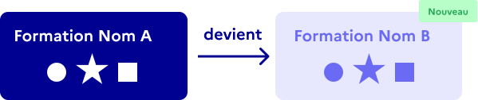
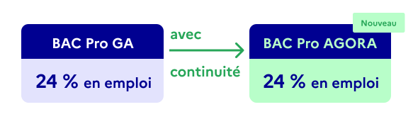
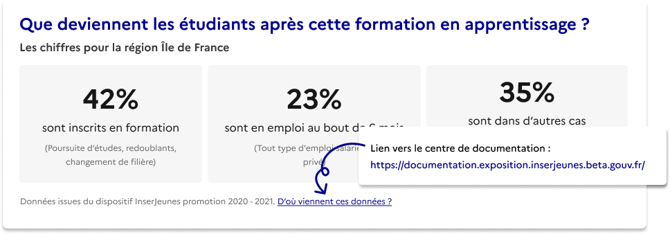
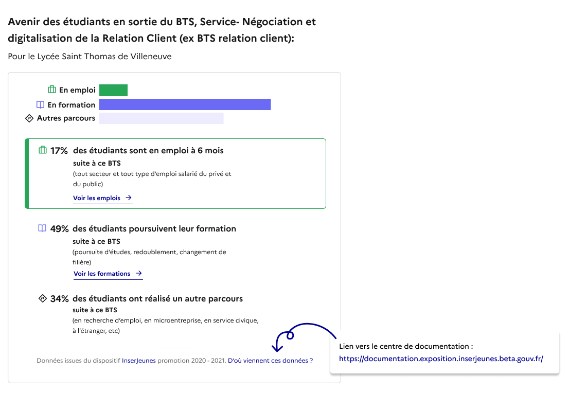

# La continuité des données dans le cadre de la rénovation des formations

{: .no_toc }

## Table des matières

{: .no_toc .text-delta }

- TOC
{:toc}

## Un plus grand nombre de certifications afficheront les données InserJeunes

Dans le cadre de la rénovation du catalogue des formations, un certain nombre de formations et de diplômes ont été renommés sans changement du contenu de leurs programmes.
Ces formations étaient alors considérées comme nouvelles, aucune donnée sur le devenir des apprenants n’a pour l’instant été calculé pour les promotions sortant de ces formations.

**Nous avons pu rétablir le lien qui avait été rompu entre les données recueillies sur une certification avant et après son changement de nom.**

Il s’agit de retracer l’historique d’une formation pour lui associer les données de sa formation d’origine. Faire ce lien permet alors d’exposer les données pour la formation rénovée.

**Ces données sont d’autant plus importantes à afficher qu’elles portent sur des formations répondant à un besoin social et économique.**

**Ainsi nous pouvons vous fournir les données pour ces certifications rénovées qui n’ont pas fait l’objet de modification structurelle.**

## Quelles certifications sont concernées ?

- Les certifications professionnelles, lycées professionnels (CAP, mention…)
- Les certifications professionnelles de la voie apprentissage existant également en voie scolaire. (BTS, Bac Pro …)

## Quel impact sur le nombre de certifications comprenant des données ?

{: .highlight }
🎯 +139 nouvelles formations présentent désormais les indicateurs InserJeunes.

Sur 1073 formations du CAP au BTS, à l’échelle nationale.

{: .highlight }
🎯 + 24 points de progression sur le nombre de certifications de la voie scolaire présentant les données.

Aux échelles nationales et régionales

{: .highlight }
🎯 +17.6 points de progression sur l**e nombre **certifications de la voie apprentissage présentant nos données.

Aux échelles nationales et régionales

## Les cas dans lesquels nous avons mis en place cette continuité

- La formation rénovée ne fait pas l'objet d'une modification profonde de ses modules.
- La formation rénovée n'a pas de données pour le millésime concerné.
- Nous associons également, dans le sens inverse, les données de la formation rénovée avec les formations historiques lorsque celles ci ne possèdent pas de données pour le millésime concerné.

## L’exemple de la certification "BAC Pro AGORA"

**Avant :**

La nouvelle certification “**Bac Pro AGORA”** (Assistance à la gestion des organisations et de leurs activités) n’avait pas de données alors que l’ancienne certification **“Bac Pro GA”** (Gestion Administration) avait des données.

**Après :**
Pour le millésime 2021, nous n'avions pas de données pour le nouveau Bac Pro AGORA nous associons donc les données 2021 du **Bac Pro GA** au **Bac Pro AGORA**.

{: .note }
📖 Consulter ici la documentation technique : [Détails sur l’impact de la continuité des données sur le taux de couverture]({{ site.baseurl }})

## En tant que partenaire, qu’est-ce que cela implique pour vous ?

Si vous utilisez notre API

À destination des équipes techniques :

- Mise à jour : **Vous n’avez rien à faire**, le continuum est mis en place automatiquement. Vous pouvez savoir si les données retournées proviennent d’une formation historique en utilisant le champs `donnee_source` (Cf: [documentation API](https://exposition.inserjeunes.beta.gouv.fr/api/doc/))
- **Nous vous conseillons d’ajouter un lien vers** [la documentation InserJeunes](https://documentation.exposition.inserjeunes.beta.gouv.fr/) **ici présente,** afin de garantir la transparence pour les utilisateurs :
  - Le lien : https://documentation.exposition.inserjeunes.beta.gouv.fr/
  - Un exemple d’affichage de ce lien, ci-dessous en bleu :
    

Si vous affichez notre widget dans vos pages

- Mise à jour : Vous n’avez rien à faire.
- Le widget ne précise pas si les données proviennent d’une formation historique ou de la formation en elle même car l’information est technique et ne sert pas le lecteur.
  - Afin de garantir la transparence pour les utilisateurs, nous vous conseillons d’ajouter un lien vers l[a documentation InserJeunes ici présente :](https://documentation.exposition.inserjeunes.beta.gouv.fr/) https://documentation.exposition.inserjeunes.beta.gouv.fr/
    

Si vous exportez nos données

- Deux champs ont été ajouté lors d’une exportation en format CSV permettant de savoir si les données sont issues d’une formation historique.
  - `donnee_source_code_certification` et `donnee_source_type`

Si jamais vous ne souhaitez pas utiliser la continuité des données ?

- Les règles techniques applicables :
  - Si vous utilisez notre API :
    - Conserver uniquement les données dont le champ`donnee_source.type` contient la valeur `self`
  - Si vous utilisez le widget :
    - Il n’est pas possible de ne pas utiliser la continuité des données. Nous vous conseillons de changer pour un usage de nos données par API.
  - Si vous exporter nos données :
    - Conserver uniquement les données dont le champ `donnee_source_type` contient la valeur `self`

