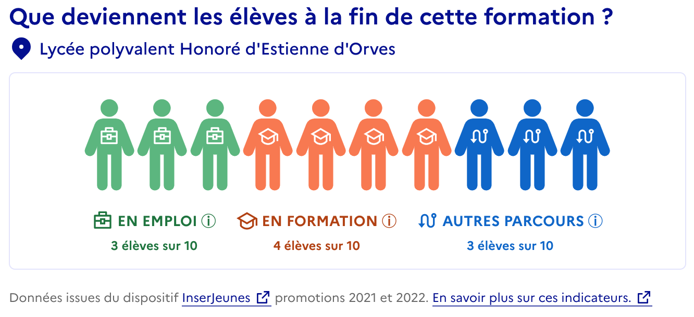

# Réutilisation des données InserJeunes sur un site tiers
{: .no_toc }

## Table des matières
{: .no_toc .text-delta }
- TOC
{:toc}

## Pourquoi afficher ces indicateurs ?

Nos indicateurs permettent de mettre en avant, de manière fiable et objective, des diplômes et formations offrant des devenirs favorables. Ils apportent aux élèves des éléments concrets sur les perspectives de poursuite d’études et d’emploi liées aux formations qu’ils envisagent de rejoindre.

Ces éléments permettent de compléter les informations, souvent descriptives ou qualitatives, offertes aux élèves sur les sites d’orientation.

## Comment afficher les indicateurs sur votre site ?

L’équipe met à disposition des développeurs, *data scientists*, etc. une “[API](https://exposition.inserjeunes.beta.gouv.fr/api/doc/)”, permettant d’automatiser la récupération des données, en amont ou au moment de l’affichage.

Une fois les données récupérées, pour l’affichage, c’est à vous de jouer ! Notre équipe se tient à votre disposition pour vous présenter des exemples de visualisation pertinentes et vous partager les bonnes pratiques associées à l’affichage des données InserJeunes. [Contactez-nous !](mailto:contact@inserjeunes.beta.gouv.fr)

*Aperçu du module de visualisation des indicateurs InserJeunes sur le site “C’est qui le pro ?”*

## Je souhaite afficher les indicateurs sur mon site

- Notre équipe a identifié un certain nombre de questions, listées dans la section suivante, pour vous aider à mieux **cerner les contours d’une intégration de nos indicateurs sur votre site**. Nous vous invitons à les parcourir et nous tenons à votre disposition pour vous aider à y répondre.
- La documentation technique, à destination de vos équipes de développement, est disponible via le lien ci-dessous. Elle permettra à vos **équipes techniques** de **se familiariser avec nos outils** et de **choisir l’option la plus adaptée à vos besoins et ressources**.

  {: .note }
  📌 [Documentation d'utilisation de l'API](https://exposition.inserjeunes.beta.gouv.fr/api/doc/)
    
- Enfin, **pour en savoir plus sur la réutilisation des données** ou **demander une clef API** en vue d’une intégration, nous vous invitons à [contacter notre équipe par mail](mailto:contact@inserjeunes.beta.gouv.fr).

## Les questions à vous poser avant de vous lancer

Vous trouverez ci-dessous plusieurs questions vous permettant de mieux cadrer votre besoin et d’identifier les pré-requis relatifs à l’affichage des indicateurs InserJeunes sur votre site. Notre équipe se tient à votre disposition pour vous aider dans ce processus de réflexion. 

- Dans quel but vais-je afficher les indicateurs InserJeunes ou les indicateurs de rémunération ? Comment vais-je mesurer la réussite de cet objectif ?
- Où vais-je afficher les indicateurs sur mon site ?
- À quelle maille (nationale, régionale, établissement) vais-je afficher les indicateurs ?
- Comment sont identifiées les formations et les établissements sur mon site (Code formation diplôme, MEFSTAT11, UAI, etc.) ?
- Comment doivent s’afficher les indicateurs ?
- Quelles ressources design et techniques (temps de développement, outils d’*analytics*, etc.) ai-je à disposition ?