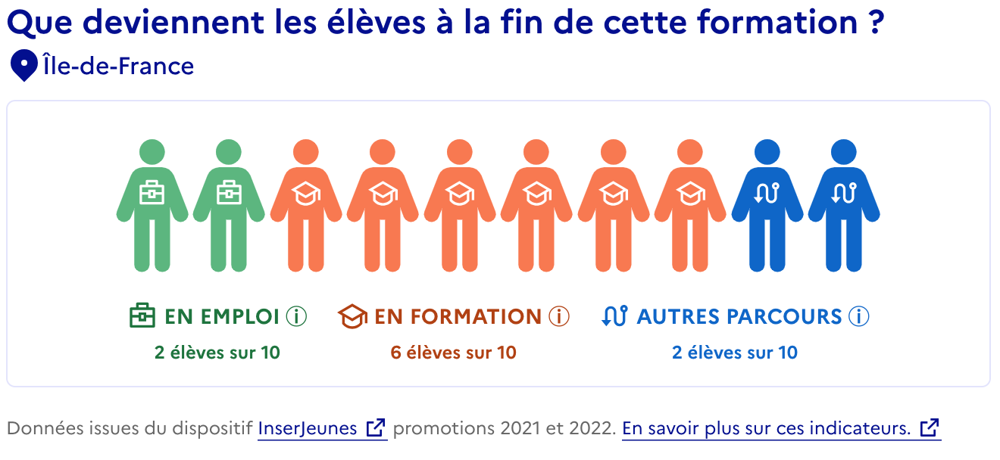

# Widget Exposition [supprimé]

*Le widget a été supprimé de l’API en Avril 2025. Utile pour convaincre de nouvelles plateformes et les inspirer, il n’est cependant pas utilisé par les principaux ré-utilisateurs et sa présence pourrait compliquer la reprise par les services statistiques.*

## Description

Le *widget* permet d’**intégrer plus simplement les données InserJeunes au sein d’un site web**.

Alors que l’utilisation de l’API implique de coder :

- la construction et l’appel de la route permettant d’aller chercher les données
- le traitement des données reçues
- l’affichage des données (en prenant en compte les données incomplètes, manquantes, etc.)

le *widget* permet de se passer des deux dernières étapes, et donc de simplifier grandement le travail du développeur et du designer, **en affichant (via une iFrame pour la v2, une image svg pour la v1) les données InserJeunes déjà mises en forme**.

## Exemple

Le lien suivant (exemple sur l'environnement de “recette”) : [https://exposition-recette.inserjeunes.beta.gouv.fr/api/inserjeunes/certifications/32032002/widget/405gzotlu16th36](https://exposition-recette.inserjeunes.beta.gouv.fr/api/inserjeunes/certifications/32032002/widget/405gzotlu16th36)
permet, à partir de l’identifiant “32032002” d’une formation (ici un code CFD) et d’un code région (ici 11, correspondant à l’Île-de-France), de générer le visuel suivant :



Ce visuel peut être intégré dans le site d’un partenaire via une “iFrame”, avec le code suivant (l’exemple est encore une fois sur la recette) : 

```jsx
<iframe onLoad="!function(t){window.addEventListener('message',function(e){'https://exposition-recette.inserjeunes.beta.gouv.fr'!==e.origin||isNaN(e.data)||(t.style.height=e.data+'px')},!1)}(this);" style="width: 100%; height: 0;" src="https://exposition-recette.inserjeunes.beta.gouv.fr/api/inserjeunes/certifications/32032002/widget/405gzotlu16th36?" scrolling="no" frameBorder="0"></iframe>
```

- La source (”src”) contient simplement le lien vers le contenu du widget. Le “seul” travail de code du partenaire sera de modifier cette URL en fonction de la certification / formation à afficher, en fournissant notamment les bons codes CFD / MEFSTAT11 et UAI
- Le contenu de la fonction “onLoad” sert à assurer le côté responsive du widget. Il n’est pas strictement nécessaire si le partenaire gère le redimensionnement dans son code.

## Documentation

Une clef est nécessaire pour utiliser le widget (elle nous sert notamment à mieux suivre l’utilisation du widget par le partenaire).

Les routes correspondantes au *widget* sont documentées avec celles de l’API “standard” (ce sont celles se finissant par /widget) : 

[Documentation technique / Swagger](https://exposition.inserjeunes.beta.gouv.fr/api/doc/#/)

Les routes correspondant au widget servent à construire le code (voir ci-dessus) qui sera a intégrer dans la page du partenaire.